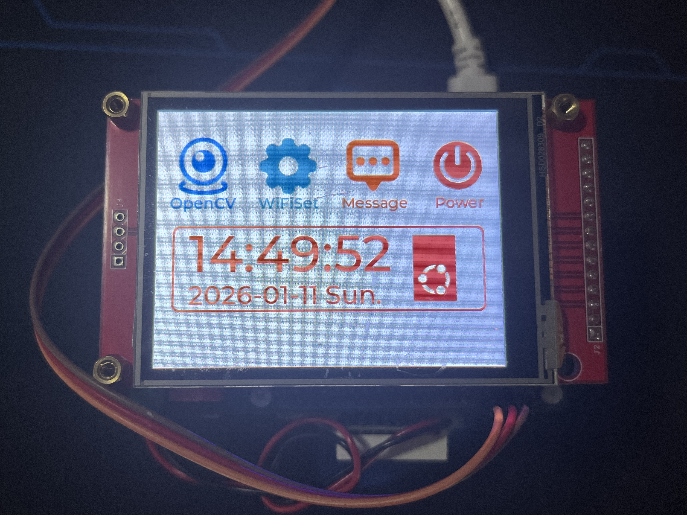
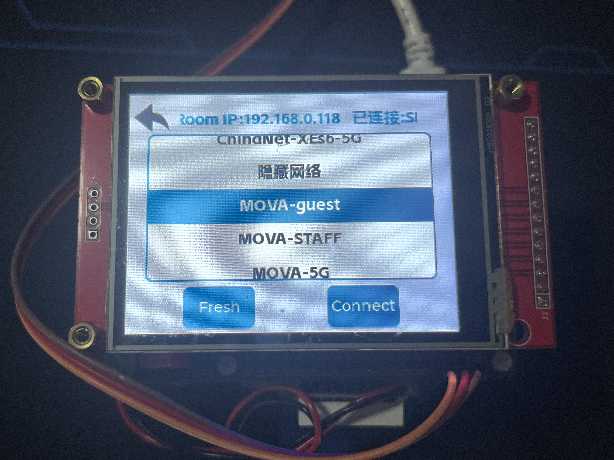

# raspberrypi-lvgl-terminal

基于LVGL的树莓派4B终端。集成多种设备功能，包括OpenCV摄像头、WiFi、电源管理和传感器等，让你落灰的树莓派可脱离HDMI显示屏获取摄像头画面、连接WiFi、获取IP、关机重启等。




## 功能特性

- **LVGL图形界面**：使用LVGL库构建的嵌入式GUI界面
- **OpenCV集成**：实时摄像头视频流处理与物体检测
- **WiFi管理**：WiFi网络扫描、连接及状态管理
- **传感器支持**：TM7711模数转换器支持
- **电源管理**：关机和重启功能
- **时间显示**：实时日期和时间显示
- **多线程架构**：各功能模块采用独立线程运行

## 硬件要求

- 树莓派4B
- ILI9341显示屏驱动
- XPT2046触摸屏控制器
- USB摄像头
- TM7711 ADC芯片
- WiFi适配器
- WiringPi兼容GPIO接口

## 软件依赖

- LVGL (Light and Versatile Graphics Library)
- OpenCV 4.x
- WiringPi
- Linux系统工具链

## 编译和运行

### 克隆仓库

```bash
git clone https://github.com/CaddonThaw/raspberrypi-lvgl-terminal.git && cd raspberrypi-lvgl-terminal
```

### 安装依赖

```bash
sudo apt-get install -y \
    build-essential \
    cmake \
    pkg-config \
    libopencv-dev \
    libiw-dev 
git clone https://github.com/WiringPi/WiringPi.git 
cd WiringPi && ./build && cd ..
```

### 编译

```bash
# 屏幕型号默认为ST7789
make

# 如果屏幕型号是ST7789
make DISPLAY=ST7789

# 如果屏幕型号是ILI9341
make DISPLAY=ILI9341
```

### 运行

```bash
sudo ./demo
```

> 注意：由于涉及硬件访问，通常需要root权限

## 项目结构

```
LVGL_OpenCV/
├── lvgl/                # LVGL图形库
├── lv_drivers/          # LVGL显示和输入设备驱动
├── ui/                  # 图形界面定义
├── devices/             # 设备驱动模块
│   ├── opencv/          # OpenCV摄像头处理
│   ├── wifi/            # WiFi网络管理
│   ├── power/           # 电源管理
│   ├── tm7711/          # TM7711 ADC驱动
│   └── threads/         # 多线程管理
├── main.cpp             # 主程序入口
└── Makefile             # 构建脚本
```

## 引脚映射

### 显示屏引脚 (ILI9341)
- **SPI_CHANNEL**: 0 (CE0)
- **SPI_SPEED**: 40MHz
- **PIN_CS (片选)**: BCM 8 (物理引脚 24)
- **PIN_DC (数据/命令)**: BCM 24 (物理引脚 18)
- **PIN_RST (复位)**: BCM 25 (物理引脚 22)
- **PIN_BLK (背光控制)**: BCM 23 (物理引脚 16)

### 触摸屏引脚 (XPT2046)
- **SCLK (时钟)**: BCM 21 (物理引脚 40)
- **MOSI (主输出从输入)**: BCM 20 (物理引脚 38)
- **MISO (主输入从输出)**: BCM 19 (物理引脚 35)
- **CS (片选)**: BCM 16 (物理引脚 36)
- **IRQ (中断请求)**: BCM 26 (物理引脚 37)

### TM7711 ADC引脚
- **TM7711_CLK_PIN**: BCM 27 (GPIO.2)
- **TM7711_SDA_PIN**: BCM 17 (GPIO.0)

### 电源管理引脚
- **PIN_BLK**: BCM 23 (物理引脚 16) - 用于电源控制

## 功能模块说明

### OpenCV模块
- 实时摄像头视频捕获
- 红色物体检测与跟踪
- 视频帧处理与显示

### WiFi模块
- 附近WiFi网络扫描
- WiFi连接管理
- IP地址获取与显示

### 电源管理模块
- 系统安全关机
- 系统重启功能

### 时间模块
- 实时时间显示
- 日期信息展示

### 传感器模块 (TM7711)
- ADC数据采集
- 传感器信号处理

## 界面导航

- **主界面**：包含OpenCV、设置、消息和电源按钮
- **OpenCV界面**：显示摄像头捕获的画面及物体检测结果
- **设置界面**：WiFi配置和网络设置
- **消息界面**：传感器数据和其他信息显示
- **电源界面**：关机和重启选项

## 自定义扩展

此项目设计为模块化架构，可以轻松添加新的设备驱动或功能模块：

1. 在`devices/`目录下创建新模块
2. 实现相应的初始化和处理函数
3. 在主线程中启动该模块的线程
4. 如需要，更新UI以反映新功能

## 脚本工具

### build.sh

编译项目并安装依赖项的脚本。

**使用方法：**
```bash
./scripts/build.sh
```

### install.sh

设置开机自启动服务的脚本，使demo程序在系统启动时自动运行，并在程序崩溃时自动重启。

**使用方法：**

启用开机自启动：
```bash
./scripts/install.sh --enable
```

禁用开机自启动并停止当前运行的服务：
```bash
./scripts/install.sh --disable
```

显示帮助信息：
```bash
./scripts/install.sh --help
```

**注意事项：**
- 在运行任一脚本前，请确保当前目录下存在 `demo` 可执行文件
- `install.sh` 脚本需要管理员权限来管理系统服务

## 故障排除

如果遇到编译错误，请检查：
- OpenCV是否正确安装
- WiringPi库是否可用
- 是否具有访问硬件设备的权限

如遇运行时问题：
- 确保硬件设备已正确连接
- 检查设备权限
- 确认内核支持所需设备驱动

如果连接WiFi失败：
- 删除所有WiFi配置文件 `sudo rm /etc/netplan/*`
- 重新应用配置 `sudo netplan apply`
- 再次尝试连接WiFi